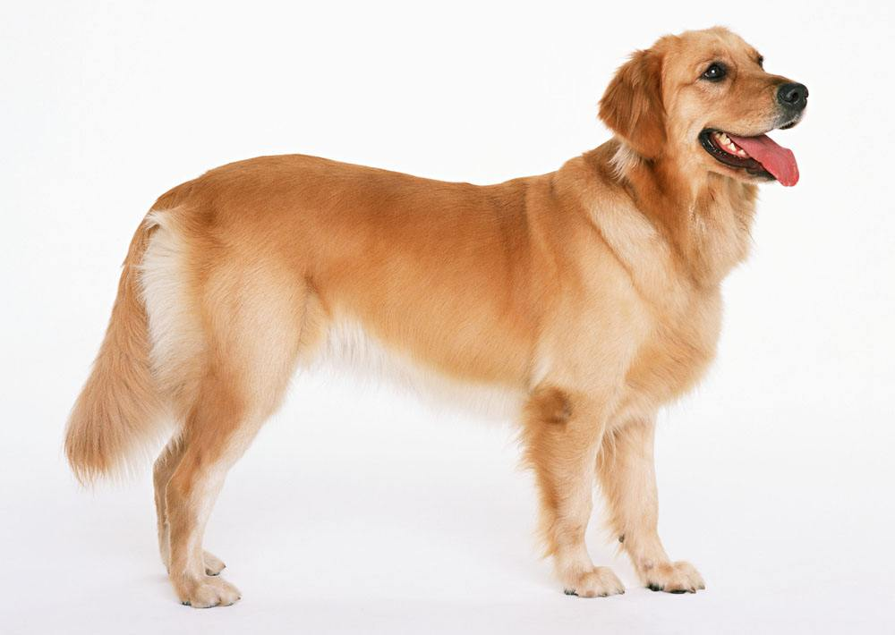

# VGG16-Tensorflow
Tensorflow Slim VGG16

## Usage 使用方法
模型保存在models文件夹里，用demo.py进行预测  

## Test 测试结果
golden retriever



```python
('Top1: ', 'n02099601 golden retriever', 0.9635902)

('Top5: ', [('n02099601 golden retriever', 0.9635902), 
            ('n02099712 Labrador retriever', 0.032913934), 
            ('n02108551 Tibetan mastiff', 0.00057865767), 
            ('n02104029 kuvasz', 0.00036995122), 
            ('n02102480 Sussex spaniel', 0.00033469478)])
```
## VGG16模型下载
[VGG-16 模型](http://download.tensorflow.org/models/vgg_16_2016_08_28.tar.gz)

## Reference参考
https://github.com/machrisaa/tensorflow-vgg  
https://github.com/balancap/SSD-Tensorflow